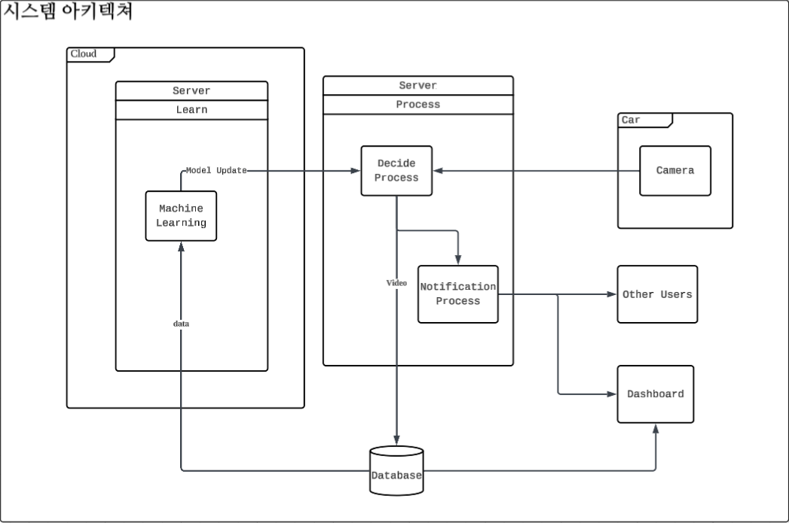
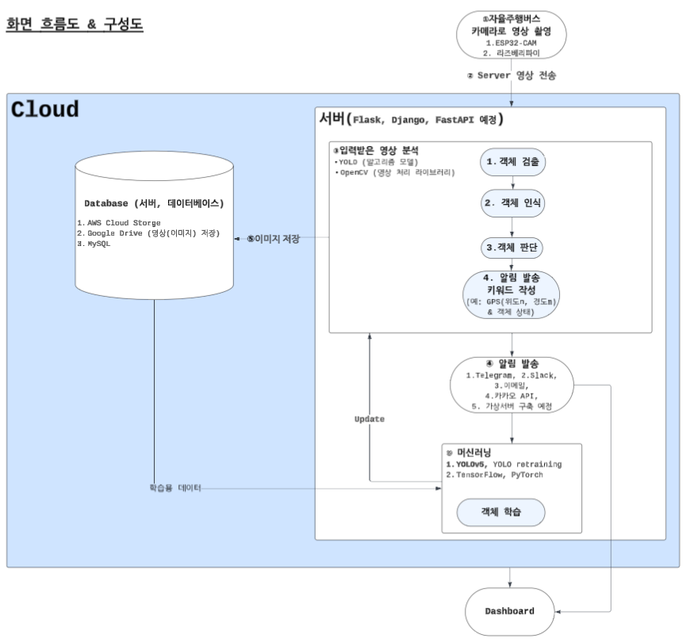

# 🚍 AutocarZ - 자율주행 중 로드킬 안전 강화 및 자동 신고 서비스
<<<<<<< HEAD
=======

# 🙋‍♂️🙋‍♀️ 팀원 소개

<table>
  <tr>
    <th>김지영</th>
    <th>이유석</th>
    <th>사석훈</th>
    <th>신윤서</th>
  </tr>
  <tr>
    <td></td>
    <td></td>
    <td></td>
    <td></td>
  </tr>
  <tr>
    <td>PM 임베디드 시스템 개발자 분석가</td>
    <td>팀원 임베디드 시스템 개발자 분석가</td>
    <td>팀원 Full-Stack 개발자 분석가</td>
    <td>팀원 FrontEnd 분석가</td>
  </tr>
  <tr>
    <td>
      
    </td>
    <td>
      
    </td>
    <td>
      
    </td>
    <td>
      
    </td>
  </tr>
</table>

>>>>>>> 060b2669514999ccec7337fb4352ab530d359537

# 🙋‍♂️🙋‍♀️ 팀원 소개

<table>
  <tr>
    <th>김지영</th>
    <th>이유석</th>
    <th>사석훈</th>
    <th>신윤서</th>
  </tr>
  <tr>
    <td></td>
    <td></td>
    <td></td>
    <td></td>
  </tr>
  <tr>
    <td>PM 임베디드 시스템 개발자 분석가</td>
    <td>팀원 임베디드 시스템 개발자 분석가</td>
    <td>팀원 Full-Stack 개발자 분석가</td>
    <td>팀원 FrontEnd 분석가</td>
  </tr>
  <tr>
    <td>
      
    </td>
    <td>
      
    </td>
    <td>
      
    </td>
    <td>
      
    </td>
  </tr>
</table>

----------------------------

# 프로젝트 기획서

## 1. 프로젝트 정의
- **목표**: **AI기반 자율주행 안전 강화 솔루션 설계**
- **주요 기능**:
  - 데이터 수집 및 전처리
  - 차선 인식·주행 제어
  - 야생동물/장애물 실시간 감지
  - 성능 평가 및 리포트 자동화

## 2. 주요 내용
- **프로젝트 기간**: 2025-08-25 ~ 2025-08-29
- **참여 인원**: [팀원 소개] 참고
<<<<<<< HEAD
- **데이터 사용처**: [로드킬 데이터 정보](https://www.data.go.kr/data/15045544/fileData.do), [야생동물 활동 영상 데이터](https://www.aihub.or.kr/aihubdata/data/view.do?pageIndex=1&currMenu=115&topMenu=100&srchOptnCnd=OPTNCND001&searchKeyword=%EB%A1%9C%EB%93%9C%ED%82%AC&srchDetailCnd=DETAILCND001&srchOrder=ORDER001&srchPagePer=20&aihubDataSe=data&dataSetSn=645)

=======
- **데이터 사용처**: [데이터 출처]
>>>>>>> 060b2669514999ccec7337fb4352ab530d359537

## 3. 일정 계획
![Gantt 차트]

| 작업 항목                  | 시작 날짜   | 종료 날짜   | 기간(일) |
|---------------------------|------------|------------|---------|
| 프로젝트 기획서 및 계획서 작성  | 2025-08-25 | 2025-08-29 | 5       |
| 요구사항 정의서 작성        | 2025-08-25 | 2025-08-26 | 2       |
| WBS 작성                  | 2025-08-25 | 2025-08-26 | 2       |
| 데이터 수집 및 전처리        | 2025-08-25 | 2025-08-26 | 2       |
| MAP 시각화(통계 및 분석)     | 2025-08-26 | 2025-08-28 | 3       |
| 라즈베리파이 제어 코드 구현   | 2025-08-26 | 2025-08-28 | 3       |
| Dashboard 설계             | 2025-08-25 | 2025-08-29 | 5       |
| 최종 검토 및 발표 준비     | 2025-08-28 | 2025-08-29 | 2       |
| 프로젝트 발표              | 2025-08-29 | 2025-08-29 | 1       |

-----------------------------

# 작업 분할 구조 (WBS)

## 단계별 작업 내용
### 1. 데이터 정의 및 요구사항 분석
1.1. 데이터 정의  
1.2. 상담 이력 데이터 검토  

### 2. 데이터 수집 및 설계
2.1. 아키텍처 설계  
2.2. 데이터 수집 및 전처리  

### 3. 분석 및 보고
3.1. 데이터 검증 및 모델링  
3.2. 대시보드 및 보고서 작성  

### 시각 자료

---------------------------

# 요구사항 정의서

## 1. 기능 요구사항
- 사용자 시나리오 구체화
> + 누가, 왜 알림을 받나요? (예: 보안 담당자, 매장 관리자, 아파트 입주민 등)
> + 사용자는 알림을 받고 무엇을 하나요? (예: 즉시 CCTV 영상을 확인한다, 경찰에 신고한다, 기록을 저장한다 등)
> + 알림의 형태는 어떤 것이 가장 효과적인가요? (예: 스마트폰 푸시 알림, 이메일, 문자 메시지, 경고음 등)
- 대시보드와 시연 영상 생성

> + 라즈베리파이 차선 인식 및 주행
- 영상 기반 객체 인식 기능
- 객체 미인식 시 자동 패스 처리 
- 객체 분류 및 상태 분석 기능 (정지 상태 vs 움직임 상태 분류)
- 움직임 상태일 경우, 다음 타이밍 기준 재판단 기능
- 객체 인식 위치 확인 기능
- 인식된 이미지를 DB에 저장 및 향후 학습 데이터로 활용 가능
- 자주 인식되는 위치 식별 기능

> + Kakao MAP 위에 객체 인식 GPS정보 출력
> + 사건 발생 건수 통계 시각화
> - 영상 수신 받은 서버는 알림 전송 가능
> - 서버에서 일괄 사용자 알림 발송 기능

## 2. 비기능 요구사항
- 핵심 용어 및 정책 정의
> + 객체: 우리가 인식해야 할 '객체'는 정확히 무엇인가요? 사람? 자동차? 특정 동물? 아니면 모두? (리스트를 만들어보세요)
> + 정지 상태 vs 움직임 상태: '정지'는 몇 초 이상 같은 위치에 있어야 정지인가요? '움직임'은 좌표가 몇 픽셀 이상 변해야 움직임으로 판단할 건가요?
> + 다음 타이밍 기준 재판단: '다음 타이밍'은 몇 초 후를 의미하나요? 1초? 5초? 아니면 객체의 속도에 따라 가변적인가요?
> + 자주 인식되는 위치: '자주'의 기준은 무엇인가요? (예: 하루에 10번 이상 동일한 객체가 1분 이상 머무는 위치)
- 데이터 및 환경에 대한 정보
시스템이 어떤 환경에서 어떤 데이터를 다루는지 명확히 해야 기술 스택을 정하고 개발 계획을 세울 수 있습니다.
> - 입력 데이터: 영상은 어디서 오나요? (예: 특정 모델의 IP 카메라, 웹캠, 녹화된 영상 파일 등) 영상의 해상도나 초당 프레임(fps)은 어떻게 되나요?
> - 실행 환경: 이 시스템은 어디서 실행되나요? 고성능 GPU 서버? 일반 클라우드 서버(AWS, GCP)? 아니면 저사양의 임베디드 장비(젯슨 나노, 라즈베리 파이)?
> - DB 설계: 인식된 이미지와 정보를 DB에 저장한다고 하셨는데, 어떤 정보들을 저장해야 할까요? (예: 객체 ID, 인식 시간, 객체 종류, 위치 좌표(x,y), 이미지 파일 경로 등)
+ 성공 기준(Acceptance Criteria) 정의
비기능 요구사항을 어떻게 '검증'할지 기준을 세우는 단계입니다. 이게 있어야 나중에 프로젝트가 성공했는지 객관적으로 판단할 수 있습니다.
> - 객체 인식 시 1초 이내 처리: 이 '1초'는 어느 시점부터 어느 시점까지를 의미하나요? (예: 영상 프레임이 서버에 도착한 순간부터 객체 판별이 끝나는 순간까지)
> - 객체 인식률: 목표로 하는 인식 정확도는 몇 %인가요? (예: 사람은 99% 이상, 자동차는 95% 이상)
> - 비동기적 병렬 처리되어 동시 전송: 동시에 몇 개의 이벤트까지 안정적으로 처리할 수 있어야 하나요? (예: 100개의 카메라에서 동시에 이벤트가 발생해도 5초 내에 모두 알림 전송 가능)

- 객체 인식 후 알림까지 5초 이내 수행
- 객체 인식은 실시간 처리 동작
- 객체 종류 확장 가능
- DB 외부 접근 불가, 오직 서버만 가능 (보안성 강화)
---------------------------

# 프로젝트 설계서

## 1. 데이터 아키텍처
- **설계 개요**:
  - 데이터 수집: [수집 방식]
  - 데이터 저장: [저장 방식]
  - 분석 및 시각화: [사용 기술]

## 2. 기술 스택
- 데이터 수집: Python, API 연동
- 분석 및 처리: Pandas, NumPy
- 시각화: Matplotlib, Dash

## 3. 설계 이미지

---------------------------

# 데이터 연동 정의서

## 1. 데이터 정의
- 데이터 소스: 상담 이력 데이터
- 주요 컬럼:
  - user_id: 사용자 ID
  - timestamp: 상담 시간
  - feedback: 상담 내용

## 2. 연동 방식
- 연동 방식: API 또는 Batch 수집
- 연동 주기: 매일 자정

--------------------------

# 클라우드 아키텍처 설계서

## 1. 아키텍처 개요
- **사용 서비스**:
  - AWS S3: 데이터 저장소
  - AWS Lambda: 데이터 처리
  - AWS QuickSight: 대시보드

## 2. 설계 이미지
### 2-1. 시스템 아키텍처

### 2-2 시스템 흐름도

-------------------------

# 시각화 리포트

## 1. 분석 결과 요약
- 상담 이력 데이터 분석 결과:
  - 주요 패턴: [결과 요약]
  - 통계적 분석 결과: [결과 요약]

## 2. 대시보드

## 3. 제안
- 데이터를 기반으로 [구체적인 제안 내용]

--------------------------

# 프로젝트 회고

## 1. 프로젝트 개요
- **프로젝트 이름**: [프로젝트 명]
- **기간**: [YYYY-MM-DD ~ YYYY-MM-DD]
- **팀 구성원**: [팀원 이름]

---

## 2. 회고 주제
### 2.1. 잘한 점 (What went well)
- 프로젝트에서 효과적으로 수행된 작업 또는 성공 사례
  - 예: 데이터 수집 자동화 구현 성공
  - 예: 팀원 간 원활한 협업과 커뮤니케이션

---

### 2.2. 개선이 필요한 점 (What could be improved)
- 프로젝트 과정에서 비효율적이었거나 개선이 필요한 부분
  - 예: 초기 요구사항 정의가 명확하지 않음
  - 예: 데이터 전처리에 예상보다 시간이 많이 소요됨

---

### 2.3. 배운 점 (Lessons learned)
- 이번 프로젝트를 통해 학습한 내용
  - 예: 특정 기술 도구에 대한 이해 증대 (예: AWS, Docker)
  - 예: 데이터 파이프라인 최적화 방법

---

### 2.4. 다음 단계 (Action items)
- 향후 프로젝트에 적용할 개선 방안 또는 실행 계획
  - 예: 초기 단계에서 요구사항 정의에 더 많은 시간 할당
  - 예: 데이터 전처리 자동화 도구 도입 검토

---

## 3. 팀원별 피드백
- **팀원 A**:
  - 강점: [예: 주어진 업무를 책임감 있게 수행함]
  - 개선점: [예: 코드 리뷰 시 세부적인 피드백 추가 필요]
  
- **팀원 B**:
  - 강점: [예: 데이터 분석에 창의적인 접근법 적용]
  - 개선점: [예: 업무 진행 상황을 더 자주 공유]

---

## 4. 프로젝트 주요 결과 요약
- **성과**:
  - 상담 이력 데이터를 활용한 분석 모델 개발 완료
  - 대시보드와 보고서 배포 성공
- **결과물**:
  - [링크]: 프로젝트 산출물 GitHub 저장소
  - [링크]: 시각화 대시보드

---

## 5. 자유로운 의견
- 프로젝트 과정 중 느낀 점, 제안 사항, 또는 기타 의견
  - 예: 팀원들 간의 협업이 매우 원활했고, 다음 프로젝트에서도 같은 방식을 유지하고 싶음.
  - 예: 시간 관리가 다소 아쉬웠으므로, 다음 프로젝트에서는 좀 더 구체적인 일정 관리 툴을 활용하고 싶음.......
